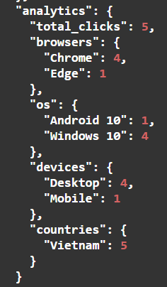

# URL Shortener Service

Backend Service rút gọn link tương tự bit.ly, tinyurl - Golang.

**Live Demo:** https://shorten.quocbui.dev/swagger/index.html

## Mô tả bài toán

User có URL dài muốn rút gọn thành link ngắn. Khi truy cập link ngắn sẽ tự động redirect về URL gốc và hệ thống tracking số lượt click, thông tin thiết bị, vị trí.

```
Input:  https://example.com/very/long/path?param1=value1&param2=value2
Output: https://shorten.quocbui.dev/abc123
```

## Tính năng

- Tạo link rút gọn (có/không đăng nhập)
- Custom alias (vd: `/my-link`)
- Link expiration
- Analytics: click count, browser, OS, device, country
- QR Code với logo
- Rate limiting (100 req/60s)
- JWT Authentication
- Swagger API docs

## Tech Stack

| Component | Choice | Lý do |
|-----------|--------|-------|
| Language | Go 1.24 | Performance cao, concurrency native, binary nhẹ |
| Framework | Gin | Lightweight, ecosystem tốt |
| Database | PostgreSQL | ACID, indexing mạnh, GORM support tốt |
| Auth | JWT | Stateless, scale horizontal dễ |
| Deploy | Docker + Caddy | Auto HTTPS, config đơn giản hơn Nginx |

## Cách chạy

### Local
```bash
git clone https://github.com/quocbui2020/shorten_url.git
cd shorten_url
cp .env.example .env
# Sửa .env credentials 
make run
# → http://localhost:8080/swagger/index.html
```

### Docker
```bash
cp .env.example .env
docker-compose up -d --build
```

### Make Commands
```bash
make run       # Chạy dev server
make build     # Build binary ra bin/app
make test      # Chạy tests với coverage
make swagger   # Generate Swagger docs
make tidy      # go mod tidy
make fmt       # Format code
```

### Chạy Tests
```bash
# Chạy tất cả tests
go test ./tests/...

# Chạy tests cụ thể
go test -v ./tests/unit/service/...
go test -v ./tests/unit/utils/...

# Xem coverage
go test -cover ./tests/...
```

## API Endpoints

| Method | Endpoint | Mô tả |
|--------|----------|-------|
| POST | `/api/v1/auth/register` | Đăng ký |
| POST | `/api/v1/auth/login` | Đăng nhập |
| POST | `/api/v1/shorten` | Tạo link rút gọn |
| GET | `/api/v1/me/links` | Danh sách links của user |
| GET | `/api/v1/me/links/:code` | Chi tiết + analytics |
| DELETE | `/api/v1/me/links/:code` | Xóa link (soft delete) |
| GET | `/:code` | Redirect về URL gốc |

## Thiết kế Database

```
users (1) ──→ (N) links (1) ──→ (N) clicks
```

**Indexes:**
- `links.short_code` - UNIQUE, lookup O(1)
- `links.user_id` - Query links theo user
- `links.expires_at` - Filter expired links
- `clicks.link_id` - Aggregate analytics
- `clicks.clicked_at` - Time-series queries

**Tại sao PostgreSQL thay vì NoSQL?**
- Cần ACID cho việc tạo short code unique
- Foreign key đảm bảo data integrity
- Aggregate queries cho analytics phức tạp
- GORM migration tự động

## Thuật toán Generate Short Code

```go
const charset = "abcdefghijklmnopqrstuvwxyzABCDEFGHIJKLMNOPQRSTUVWXYZ0123456789"
// 62^6 = 56.8 tỷ combinations
```

- Dùng `crypto/rand`
- Retry tối đa 5 lần 
- Custom alias: 3-20 ký tự

**Tại sao không dùng hash (MD5/SHA)**
- Random 6 chars với 62 charset đủ cho scale vừa
- Đơn giản, dễ debug

## Xử lý Concurrency

**Vấn đề:** 2 requests cùng tạo link với alias "my-link" cùng lúc?

**Giải pháp:**
```go
// Transaction
err = s.txManager.ExecuteInTransaction(func(tx *gorm.DB) error {
    existing, _ := s.linkRepo.GetByShortCodeForUpdate(tx, *customAlias)
    if existing != nil {
        return ErrAliasAlreadyExists
    }
    return s.linkRepo.CreateWithTx(tx, link)
})
```

- Row-level locking ngăn race condition

## Trade-offs

### 1. Guest User vs Anonymous Links
**Chọn:** Tự động tạo guest account khi shorten không có token

**Ưu điểm:**
- User có thể xem lại links đã tạo
- Mọi link đều có analytics
- Dễ convert guest thành registered user sau này

**Nhược điểm:**
- Tạo nhiều records, cần cleanup job

### 2. QR Code Generation
**Chọn:** Generate on-the-fly, trả về base64

**Ưu điểm:**
- Không tốn storage
- Luôn up-to-date

**Nhược điểm:**
- Tốn CPU mỗi request
- *Cải thiện:* Cache với Redis hoặc pre-generate

### 3. Click Tracking
**Chọn:** Async goroutine + transaction

```go
go s.trackClick(link.ID, clickInfo)  // Không block redirect
```

**Ưu điểm:**
- Redirect response nhanh 
- Transaction đảm bảo click record + click_count

**Nhược điểm:**
- Có thể mất click nếu server crash giữa chừng
- *Cải thiện:* Message queue (Kafka/RabbitMQ)

## Challenges & Solutions

### Race Condition khi tạo Custom Alias
2 requests cùng muốn alias "my-link", cả 2 check thấy chưa tồn tại → cả 2 insert → lỗi.

Fix: Sử dụng `SELECT ... FOR UPDATE` trong transaction, request đầu sẽ lock row, bắt request sau phải đợi.

### N+1 Query trong Analytics
Ban đầu query riêng từng loại (browser, OS, device...) → nhiều round-trip tới DB.

Fix: Gom lại thành batch queries với GROUP BY, 1 query lấy hết.

## Security

- Người dùng không get được links của người khác (jwt)
- URL phải bắt đầu bằng http/https, tối đa 2048 ký tự
- Rate limit 100 req/60s theo IP
- Xóa link với soft delete

## Performance

### Scale tới 1 triệu links

| Vấn đề | Cách xử lý |
|--------|------------|
| Query chậm | Index trên `short_code`. B-tree search O(log n), 1M records chỉ cần ~20 lần so sánh |
| Response nặng | Pagination, mỗi page 10-50 records thay vì load hết |
| Hết connection | GORM có sẵn connection pool, reuse connection thay vì tạo mới |

### Scale traffic lên 100x

| Vấn đề | Hướng giải quyết |
|--------|------------------|
| DB quá tải redirect | Thêm Redis cache cho hot links |
| Analytics query chậm | Read replicas, tách đọc/ghi |
| Mất click data | Message queue buffer, xử lý async |

## Limitations & Future Improvements

### Referer Tracking
Facebook, Instagram và nhiều social platforms set `Referrer-Policy: no-referrer` khi redirect ra external links. Nghĩa là khi user click link từ Facebook, server không nhận được referer header → hiển thị "Direct".

### Hiện tại còn thiếu
- Custom domain cho user
- Hệ thống trả phí cho user
- Quản lý user auth đầy đủ
- Quản lý realtime cho analytics overview
- Phân quyền

### Production-ready cần thêm
- Distributed rate limiting scale lên Redis
- Integration tests và CI/CD actions
- Metrics & monitoring 
- Structured logging 
- Database backup 
- Tính năng nghiệp vụ

## Screenshots


